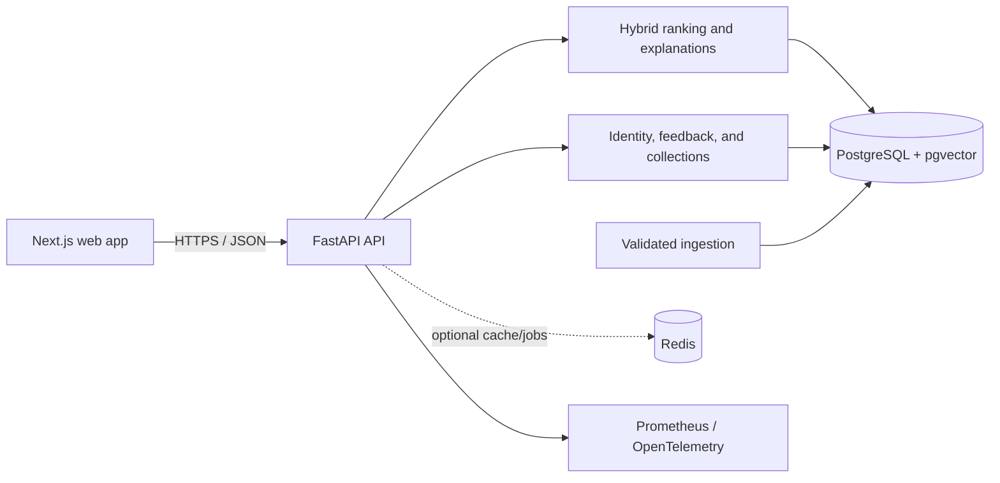

# TamilTrove V2

TamilTrove is a multilingual Tamil-cinema discovery application. It combines semantic and lexical retrieval so people can describe a plot, mood, theme, actor, or viewing situation in English, Tamil, or Tanglish and receive explainable movie recommendations.

V2 turns the original search demo into a full product: stable catalog identifiers, PostgreSQL and pgvector storage, structured filters, accounts, explicit feedback, content-based personalization, collections, data-quality controls, relevance evaluation, and production telemetry.

## What is included

- Hybrid discovery with English, Tamil, Tanglish, and mixed-language query normalization.
- Release-year, genre/theme, cast/crew, runtime, certificate, popularity, quality, and consumed-title filters.
- Evidence-based explanations and transparent ranking-version metadata.
- Registration, sign-in, preferences, ratings, likes, dismissals, watchlists, history, export, and account deletion.
- Personalized, similar-movie, hidden-gem, and cold-start recommendation surfaces.
- Private, unlisted, and public ordered collections with revocable share tokens.
- A PostgreSQL/pgvector schema, repeatable catalog synchronization, provenance, quarantine, and dataset versions.
- A 120-query versioned relevance benchmark with balanced English, Tamil, and Tanglish slices.
- Health, readiness, Prometheus metrics, structured logs, optional OpenTelemetry export, alerts, and a Grafana dashboard.
- Automated quality, security, container, release, deployment, and rollback workflows.

## Architecture



The local adapter can run from the bundled catalog for fast development. PostgreSQL is the canonical production store; Redis remains optional and is not required for correctness. See [the architecture notes](docs/architecture.md) and [data-pipeline design](docs/data-pipeline.md).

## Quick start with Docker

Requirements: Docker Engine with Compose v2 and enough memory to build the two application images.

```bash
cp .env.example .env
docker compose --env-file .env -f infrastructure/compose.yml up --build
```

Open `http://localhost:3000`. The API is available at `http://localhost:8000`, with process health at `/health`, dependency readiness at `/ready`, API documentation at `/docs`, and metrics at `/metrics`.

Optional local profiles:

```bash
# Prometheus, Grafana, and the OpenTelemetry collector
docker compose --env-file .env -f infrastructure/compose.yml --profile observability up --build

# Redis, only for a measured cache or job workload
docker compose --env-file .env -f infrastructure/compose.yml --profile cache up --build
```

All published host ports bind to `127.0.0.1` by default. Compose is a local integration topology, not a public production perimeter.

## Run without Docker

Use Python 3.12 and Node.js 22.

```bash
python -m venv backend/.venv
backend/.venv/Scripts/python -m pip install -r backend/requirements.txt -r backend/requirements-dev.txt
backend/.venv/Scripts/python -m uvicorn main:app --app-dir backend --reload
```

On macOS or Linux, activate `backend/.venv/bin/activate` and run `python -m uvicorn main:app --app-dir backend --reload` instead.

In another terminal:

```bash
cd frontend
npm ci
npm run dev
```

The backend defaults to a local SQLite development store when `DATABASE_URL` is not set. Use the Compose stack to exercise the PostgreSQL migration and canonical catalog path.

## Example search

```bash
curl -X POST http://localhost:8000/api/v1/search \
  -H "Content-Type: application/json" \
  -d '{"query":"Kaithi maari one night action thriller","filters":{},"page":1,"page_size":5}'
```

Other representative queries include:

- English: `A political courtroom drama about injustice`
- Tamil: `ஒரே இரவில் நடக்கும் அதிரடி திரைப்படம்`
- Tanglish: `Vijay Sethupathi nadicha crime thriller padam`
- Mixed: `Village setting-la emotional family drama`

Empty-query search is an intentional diverse discovery mode.

## Quality and evaluation

Run the dependency-free offline guardrail:

```bash
python evaluation/scripts/validate_dataset.py
python -m unittest discover -s evaluation/tests -v
python evaluation/scripts/evaluate.py
python evaluation/scripts/release_gate.py evaluation/reports/latest.json
```

The committed deterministic baseline records **94.2% Hit@5** on 120 catalog-grounded seed queries. It is a reproducibility gate, not a claim about a deployed transformer or independently reviewed audience relevance. Before publishing external quality claims, obtain independent judgment review and run the live-API evaluation in the target environment:

```bash
python evaluation/scripts/evaluate.py \
  --api-url https://api.example.com \
  --output evaluation/reports/api-production.json
python evaluation/scripts/release_gate.py evaluation/reports/api-production.json
```

The gate checks overall and language-slice relevance, MRR/NDCG regression, errors, zero results, and latency. Methodology and limitations are documented in [search and evaluation](docs/search-and-evaluation.md).

## Verification commands

```bash
# Backend
cd backend
python -m ruff format --check .
python -m ruff check .
python -m mypy app main.py
python -m pytest tests
cd ..

# Frontend
cd frontend
npm run format:check
npm run lint
npm run typecheck
npm test
npm run build

# Deployment smoke and warm multilingual load
python -m pip install -r infrastructure/requirements-validation.txt
python infrastructure/scripts/validate_config.py
python infrastructure/scripts/smoke.py --api-url http://localhost:8000 --web-url http://localhost:3000
k6 run -e API_URL=http://localhost:8000 infrastructure/load-tests/search.js
```

CI executes formatting, linting, type checks, unit/integration tests, relevance regression, configuration checks, builds, and vulnerability scans. Main-branch releases publish commit-addressed images; deployments and rollbacks use protected GitHub environments and immutable image digests.

## Production delivery

Production requires managed PostgreSQL with pgvector, TLS, high-entropy secrets, restricted observability endpoints, encrypted backups with restore tests, and environment approvals. Start with:

- [Deployment guide](DEPLOYMENT.md)
- [Operations and incident response](docs/operations.md)
- [Security and privacy](docs/security-and-privacy.md)
- [V2 requirements traceability](docs/v2-requirements-traceability.md)

The repository deliberately does not encode a cloud vendor. A small authenticated HTTPS deployment-adapter contract lets the same guarded workflows target a managed platform, Kubernetes controller, or single-host deployment service without granting GitHub a broad interactive shell.

## Repository map

```text
backend/         FastAPI application, services, repositories, migrations, tests
frontend/        Next.js App Router application and tests
evaluation/      reviewed-query dataset, metric runner, reports, release gate
infrastructure/  Compose, telemetry, dashboards, load and operational scripts
docs/            architecture, pipeline, evaluation, security, and runbooks
.github/         CI, release, deployment, rollback, and dependency automation
```

## Known boundaries

- The bundled catalog is a development seed. Source licensing, identity, synopsis, and poster review remain the deployer's responsibility.
- The deterministic local multilingual fallback is designed for reproducibility. A transformer/model change must regenerate compatible embeddings and pass every language slice.
- Production latency and capacity depend on the target database, model, and host; the checked-in k6 profile must be run there.
- Analytics consent, retention, subprocessors, and legal notices must be defined before a public launch.
- Redis, queues, collaborative filtering, native apps, streaming, and social messaging are intentionally outside the V2 correctness path.

The detailed product and engineering brief remains in [V2.md](V2.md).
