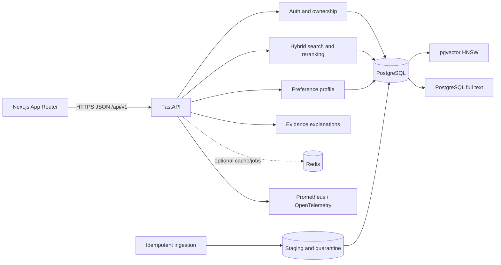
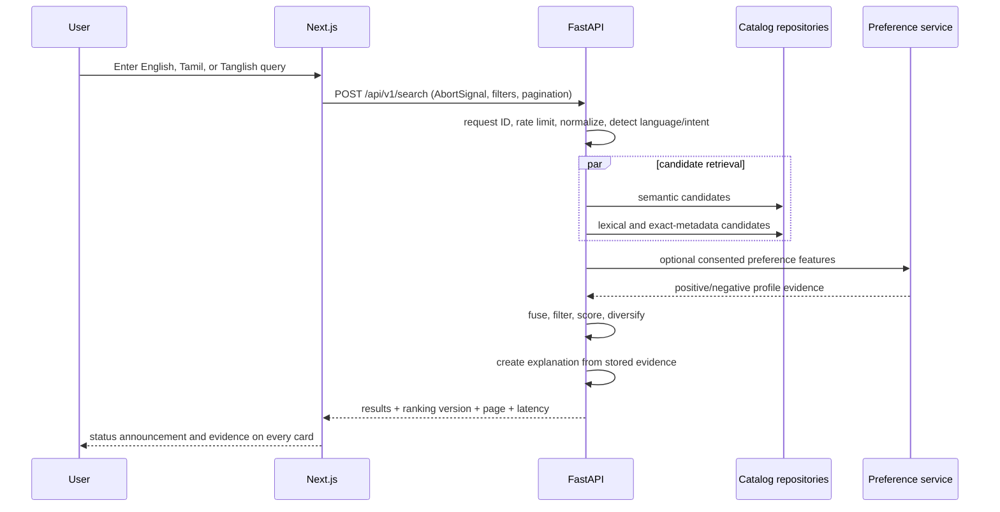

# Architecture

TamilTrove V2 is a retrieval product, not a chatbot. Responses are assembled from canonical catalog records, explicit user state, and deterministic ranking evidence.

## Runtime boundaries

- The Next.js application owns presentation, accessible interaction state, request cancellation, and safe browser-session behavior. It does not contain model credentials or decide authorization.
- FastAPI owns validation, authentication, authorization, ranking, explanations, user state, and operational telemetry. All new contracts are versioned below `/api/v1`; the V1 search route is only a compatibility adapter.
- Repositories own persistence and transactions. Services depend on repository interfaces so unit tests can run without an embedding model or network.
- PostgreSQL is canonical in production. Stable movie identifiers replace the V1 array-index coupling. pgvector and full-text indexes keep candidate retrieval inside the database at production scale.
- SQLite and deterministic local retrieval are development/test fallbacks, not claimed equivalents to pgvector production behavior.
- Redis is an optional measured optimization. Correctness never depends on an available cache.

## Search request sequence

Stale browser searches are aborted. Anonymous public queries can be cached only when their complete filter/ranking inputs are part of the key; authenticated and personalized responses must not enter a shared cache.

## Identity and ownership

Authentication establishes a user identifier, but every repository method handling a profile, interaction, watchlist, or collection also scopes its operation to that identifier. Public collection reads use an opaque share token and return an intentionally narrow projection. A private collection cannot become accessible merely by guessing its stable ID.

## Failure behavior

- `/health` answers when the process event loop is functioning; it does not promise dependencies are ready.
- `/ready` fails until catalog storage and required ranking components are usable, keeping cold model starts out of service rotation.
- Temporary enrichment failures remain in staging with bounded retry metadata. They never partially promote a movie.
- Search failures use a consistent request-ID error envelope. Logs omit raw credentials, bearer tokens, email addresses, and private profile content.
- Ranking and dataset versions travel independently, allowing relevance configuration or catalog rollback without reverting the entire application artifact.

## Deployment topology

The checked-in Compose stack is a local integration environment. Production uses immutable backend and frontend images, managed PostgreSQL with pgvector, TLS, a secret store, restricted observability endpoints, encrypted backups, and an environment approval between staging and production. See [operations.md](operations.md) for the release and rollback runbook.
