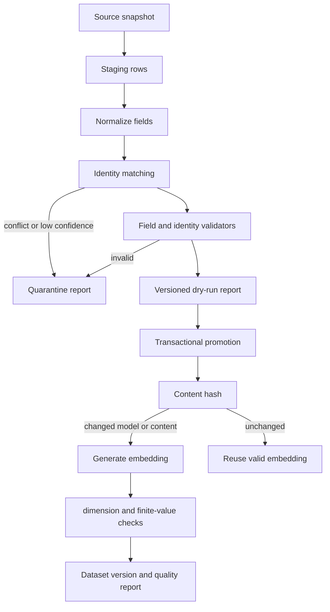

# Catalog ingestion and data quality

## Trust boundary

External datasets are evidence sources, not canonical truth. Ingestion first writes a versioned staging representation and never updates user-owned state. A record is promoted only after identity resolution and validation; suspicious records are quarantined with reasons that an administrator can inspect.

## Identity and provenance

Titles alone are never unique. Matching considers normalized original/canonical title, release year, language, director, lead cast, and stable external identifiers. Conflicting strong identifiers force quarantine rather than an arbitrary winner.

Every imported field can retain source system, source ID/URL, retrieval timestamp, transformation version, and confidence. Generated themes are visibly distinct from sourced metadata. A lower-confidence enrichment cannot overwrite a valid higher-confidence canonical value.

## Validation policy

Promotion checks required-field completeness; plausible year/runtime ranges; allowed certificate values; HTTPS poster protocols and trusted hosts; duplicate title/year/language keys; director/cast consistency; empty, truncated, boilerplate, or biography-like overviews; and embedding count, dimension, finiteness, content hash, model name, and version alignment.

The pipeline is idempotent on source version plus source identifier. Temporary network work uses bounded exponential backoff with jitter and honors provider rate limits. Permanent validation errors are not retried automatically.

## Safe operation

1. Import into a new staging/data-version record with dry-run enabled.
2. Review totals, changed-field provenance, duplicate clusters, warnings, and quarantine reasons through the admin quality endpoint/UI.
3. Back up the database and confirm the previous dataset version remains available.
4. Promote inside a transaction. Embedding generation can resume by content hash.
5. Run data validation, the relevance suite, and representative detail-page smoke checks.
6. Mark the dataset active only after gates pass.

Rollback changes the active dataset pointer to the retained previous version and reactivates the corresponding embedding/ranking compatibility set. Schema migrations remain backward compatible for at least one application release; use the migration downgrade only after application rollback and a verified backup.

The bundled V1 JSON/NumPy files remain development seed inputs. They are not evidence that every source record passed independent poster or synopsis review. Production import reports must disclose unresolved warnings rather than silently labeling the catalog validated.
